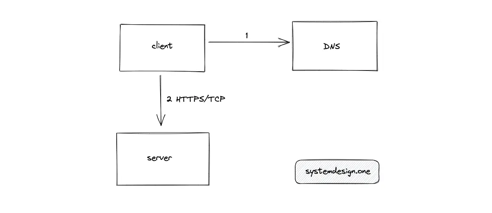

# What happens when you type a **URL** into your **Browser**

## At high level
- DNS Resolution
- TCP three-way handshake
- HTTPS upgrade
- HTTP Request/Response
- Browser rendering the response from the server

## Terminology
- **DNS** : data store that contains the mapping from domain name to IP address
- **HTTP** : standard application-level protocol used to exchange files on the internet
- **HTTPS** : secure(encrypted) version of HTTP
- **TCP** : standard that defines how to establish and maintain a network conversation between a client and a server
- **Client** : web browser or a mobile device that lets you perform different actions on the internet
- **Server** : a computer that stores files and information in the form of a website
- **URL** : web address to identify a web resource on the internet

---
## Introduction
- 1. Client -> DNS
- 2. DNS -> Client
- 3. Client(with IP) -> Server

## What is domain name resolution?
- data store that stores the mapping from a domain name (such as google.com) to its IP address (142.250.185.78)
- Each server (for example, google.com) should have a unique IP address on the internet
- DNS lets you find the IP address of the specific server on the internet using its domain name
-  domain name space (DNS hierarchy) is an inverted tree structure. The DNS hierarchy has a single domain at the top level known as the root domain

- 