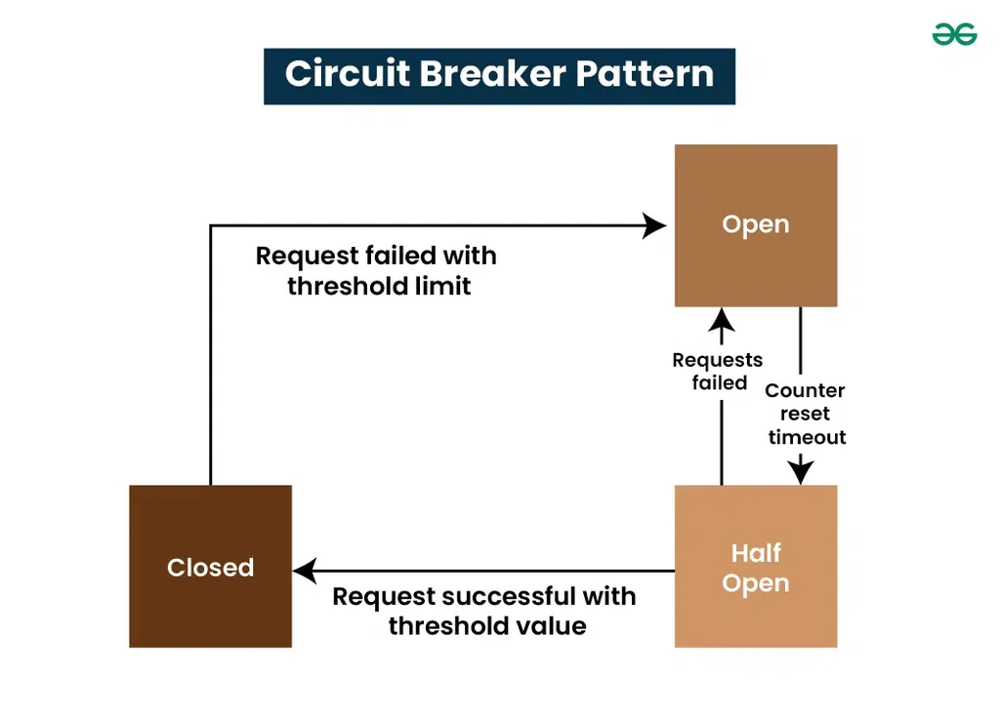
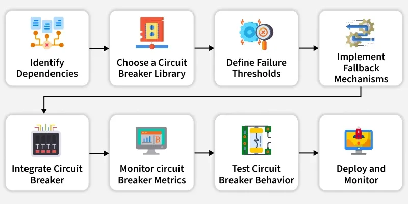

# Circuit Breaker
- prevents cascading failures by stopping calls to a failing service once errors cross a threshold
- provides fallback mechanisms to keep the system stable even when dependencies fail
- Improves resilience by monitoring service calls and “breaking” the circuit when failures occur.
- Ensures system stability in scenarios like travel booking, where slow or failed external services could disrupt the whole application.

## What is Circuit Breaker Pattern in Microservices?
- like a safety switch for microservices
- If that service starts failing repeatedly, the circuit breaker “trips” and stops further calls for a while, preventing cascades and giving the service time to recover

## Characteristics of Circuit Breaker Pattern
- Improves fault tolerance by isolating failing dependencies.
- Monitors latency, error rate, and timeouts over a rolling window
- Prevents cascades by temporarily stopping calls to an unhealthy service
- Supports fallbacks (default responses, cached data, queueing) for graceful degradation.
- Auto-recovers by probing and resetting when the service stabilizes.

## Working and Different States in Circuit Breaker Pattern
- 3 main states
    - **Closed State**
        - circuit breaker operates normally, allowing requests to flow through between services.
        - During this phase, the circuit breaker monitors the health of the downstream service by collecting and analyzing metrics such as response times, error rates, or timeouts.
    - **Open state**
        - When the monitored metrics breach predetermined thresholds, signaling potential issues with the downstream service, the circuit breaker transitions to the Open state.
        - the circuit breaker immediately stops forwarding requests to the failing service, effectively isolating it.
        - helps prevent cascading failures and maintains system stability by ensuring that clients receive timely feedback, even when services encounter issues.
    - **Half-Open State**
        - After a specified timeout period in the Open state, transitions to Half-Open state.
        - Allows a limited number of trial requests to pass through to the downstream service.
        - Monitors responses to determine service recovery.
        - If trial requests succeed, indicating service recovery, transitions back to Closed state.
        - If trial requests fail, service issues persist.
            - May transition back to Open state or remain in Half-Open state for further evaluation. 

## Steps to Implement Circuit Breaker Pattern

- **Identify Dependencies**
- **Choose a Circuit Breaker Library**
- **Integrate Circuit Breaker into Code**
- **Define Failure Thresholds**
- **Implement Fallback Mechanisms**
- **Monitor Circuit Breaker Metrics**
- **Tune Configuration Parameters**
- **Test Circuit Breaker Behavior**
- **Deploy and Monitor**

## Use Cases of Circuit Breaker Pattern
- **Protects microservices from network issues**
    * When services call each other over the network, circuit breaker helps handle **network failures**, **timeouts**, or **service unavailability**.
- **Prevents cascading failures**
    * It acts like a **barrier** so one failing service doesn’t bring down the entire system.
- **Useful for external or third-party APIs**
    * If your microservice depends on an external API, the circuit breaker stops calling it when it is down or too slow.
- **Provides fallback behavior**
    * When a service fails, circuit breaker allows the system to return a **backup response** or take an **alternative action**, keeping the app functional.
- **Helps integrate unreliable systems safely**
    * Works as a safety mechanism to handle failures in integrations so the overall system stays healthy.
- **Works with load balancers to route traffic**
    * Circuit breakers can be used along with load balancers to manage traffic to multiple service instances.
- **Automatically redirects traffic from unhealthy to healthy instances**
    * If one instance of a service fails, the circuit breaker stops sending requests to it and routes them to healthy instances.
- **Ensures the system continues working even during partial failures**
    * Overall system remains available even if some services are not.
---

## Challenges of Circuit Breaker Pattern in Microservices
- adds an extra layer of complexity to the system
- Developers need to manage its states and ensure it integrates well with existing services.
- Properly tuning the parameters for timeout, failure thresholds, and recovery periods can be tricky
- Testing circuit breaker behavior can be challenging in a development environment
- When multiple services use circuit breakers, understanding the interdependencies and potential points of failure can become complex.

## When to use Circuit Breaker Pattern
- You rely on third-party services or APIs that are known to have failures
- When dealing with services that can experience high response times, a circuit breaker can prevent excessive waiting and keep your application responsive by quickly returning fallback responses.
- For operations that consume significant resources (like database queries or external API calls), a circuit breaker can help avoid overloading the system when failures occur.
- In a microservices architecture, where services communicate frequently, a circuit breaker can protect each service from failures in others, maintaining overall system stability.
- If a service typically requires time to recover after a failure 

## Tools and Frameworks for Implementing Circuit Breaker
- **Hystrix**
    - Netflix
    - provides features like fallback mechanisms, metrics, and monitoring, helping to manage service calls effectively.
- **Resilience4j**
    - lightweight, modular library for Java is designed to work seamlessly with Spring Boot and other frameworks
    - includes a circuit breaker, along with other resilience patterns like retries and rate limiting, allowing for fine-tuned control over service interactions
- **Spring Cloud Circuit Breaker**
    - provides an abstraction for circuit breakers in Spring applications.
    - allows you to use different circuit breaker implementations (like Hystrix or Resilience4j) interchangeably, making it easy to switch between them based on your needs
- **Polly**
    - For .NET applications,
- **Istio**: 
    - as service mesh for Kubernetes, Istio offers built-in circuit breaker capabilities at the network level
    - allows you to configure circuit breakers for service-to-service communication, providing resilience without needing to modify application code.

| Feature / Library | Hystrix                  | Resilience4j              | Spring Cloud Circuit Breaker    |
| ----------------- | ------------------------ | ------------------------- | ------------------------------- |
| Maintenance       | ❌ Deprecated             | ✔ Active                  | ✔ Active                        |
| Lightweight       | ❌ No (thread pools)      | ✔ Yes                     | ✔ Depends on backend            |
| Reactive support  | ❌ Weak                   | ✔ Fully                   | ✔ Yes                           |
| Bulkhead          | ✔ Thread-pool based      | ✔ Semaphore + Thread-pool | ✔ Yes (via backend)             |
| Time limiter      | ✔ Yes                    | ✔ Yes                     | ✔ Yes                           |
| Retry             | ❌ No                     | ✔ Yes                     | ✔ Yes (via backend)             |
| Rate limiter      | ❌ No                     | ✔ Yes                     | ✔ Yes (via backend)             |
| Fallback          | ✔ Yes                    | ✔ Yes                     | ✔ Yes                           |
| Ecosystem fit     | Old Spring Cloud Netflix | Modern Java/Spring Boot   | Spring Cloud users              |
| Recommended Today | ❌ No                     | ✔ Best Choice             | ✔ Use with Resilience4j backend |
