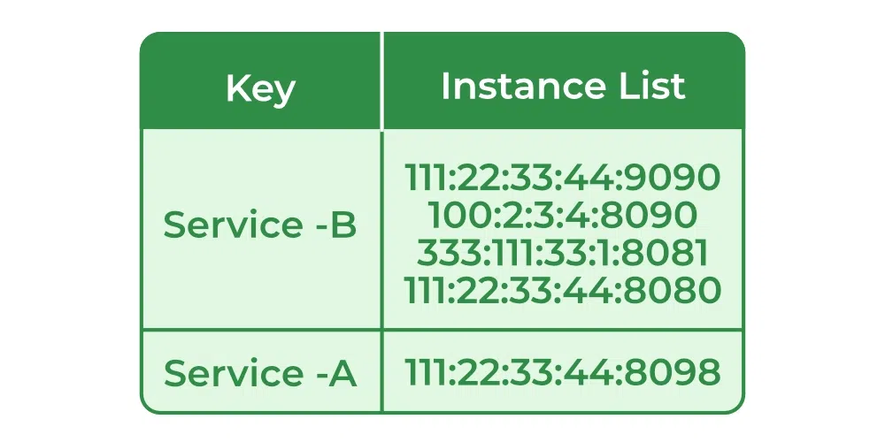
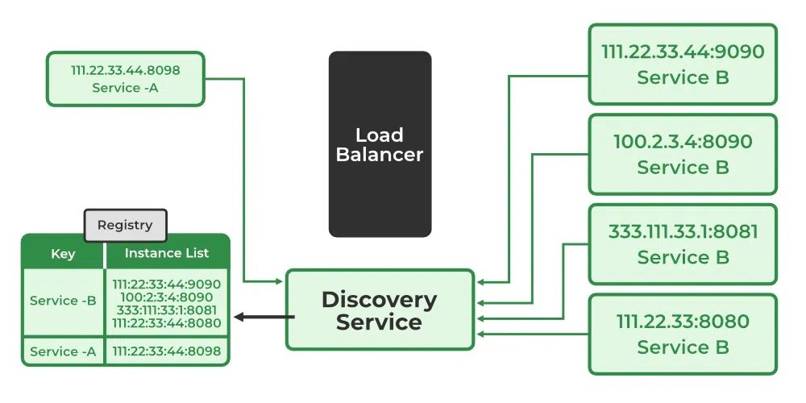
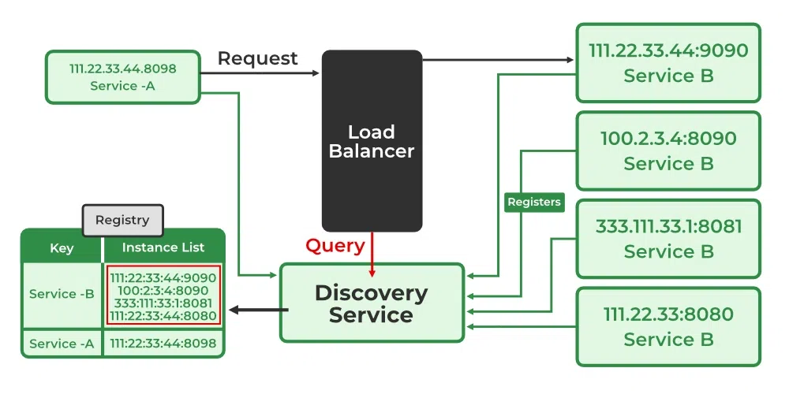
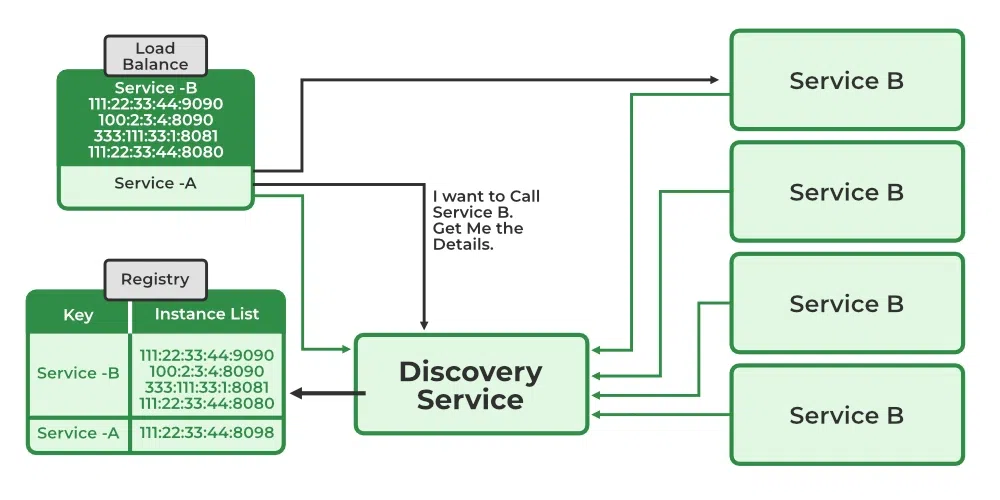

# Client Side Service Discovery in Microservices
- Microservices architecture evolved as a solution to the scalability, independently deployable, and innovation challenges with Monolithic Architecture. 
- It provides us to take a big application and break it into efficiently manageable small components with some specified responsibilities

## What is Service Discovery in Microservices?
- **Service Registry**:  it is one central location where we'll be managing our host and the port number information inside this particular server. This is basically called **registration** because all the services whenever they are starting off they are registering themselves with the discovery service and now the discovery service is maintaining all their information inside a particular map or a list or a database. 

-  It’s a database containing the network locations of service instances. A Service Registry must be highly available and up-to-date

- Service-A wants to connect to Service-B. Now the load balancer once get the request, it is gonna do a query with the discovery service that, hey, can you tell me what instances are there for Service-B? Now the load balancer finds out that there are this many instances available where Service-B has been deployed. Now Load Balancer is going to dispatch to one of the servers by looking into Service Registry. It can take all four instances of Service-B and whoever has less load then to balance the load, it can send the request to there.

- The Load Balancer job is to do load balancing while the Service Discovery job is to do discovering service info. When we build Microservices and call other microservices, we need service discovery to find the hosts and IP info and if multiple hosts are available then the load balancer helps to pick one and make a call in a load-balanced way.

## Types of Service Discovery
- Client-Side Service Discovery
- Server-Side Service Discovery

## Client Side Service Discovery

- One thing you can see over here is there is no load balancer the client is asking Service Discovery to get the details of Service-B and again the client is doing the load balancing and calling the Service-B instance by itself. This is what we call a client-side discovery.
### Advantage and Disadvantage:
- It’s an advantage because it saves an extra hop that we would’ve had with a dedicated load balancer
- It’s a disadvantage because the Service Consumer must implement the load balancing logic
- **Example**
    - Netflix Eureka
    - Zookeeper
    - Consul