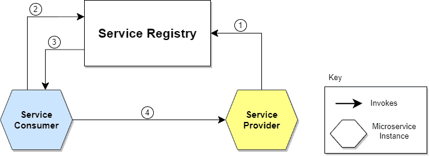

# Service Discovery in Microservices
- mechanism that allows a service to use another one without knowing its exact location.
## What is Service Discovery?
- A microservices-based application typically runs in virtualized or containerized environments. The number of instances of a service and its locations changes dynamically.
- need to know where these instances are and their names to allow requests to arrive at the target microservice
- **The Service Discovery mechanism helps us know where each instance is located. In this way, a Service Discovery component acts as a registry in which the addresses of all instances are tracked**
- instances have dynamically assigned network paths. Consequently, if a client wants to make a request to a service, it must use a Service Discovery mechanism.

## The need of Service Discovery
- A microservice needs to know the location (IP address and port) of every service it communicates with. 
- if not service discovert mechanism then service locations become coupled
- We could wire the locations or inject them via configuration in a traditional application, but it isn’t recommended in a modern cloud-based application of this kind.
- Dynamically determining the location of an application service isn’t a trivial matter. Things become more complicated when we consider an environment where we’re constantly destroying and distributing new instances of services

## How does service Discovery works?
- handles things in 2 parts
    - First, it provides a mechanism for an instance to register and say, “I’m here!” 
    - Second, it provides a way to find the service once it has registered.

- Steps
    - The location of the Service Provider is sent to the Service Registry (a database containing the locations of all available service instances).
    - The Service Consumer asks the Service Discovery Server for the location of the Service Provider.
    - The location of the Service Provider is searched by the Service Registry in its internal database and returned to the Service Consumer.
    - The Service Consumer can now make direct requests to the Service Provider.

## Implementations
### Client-side service discovery
