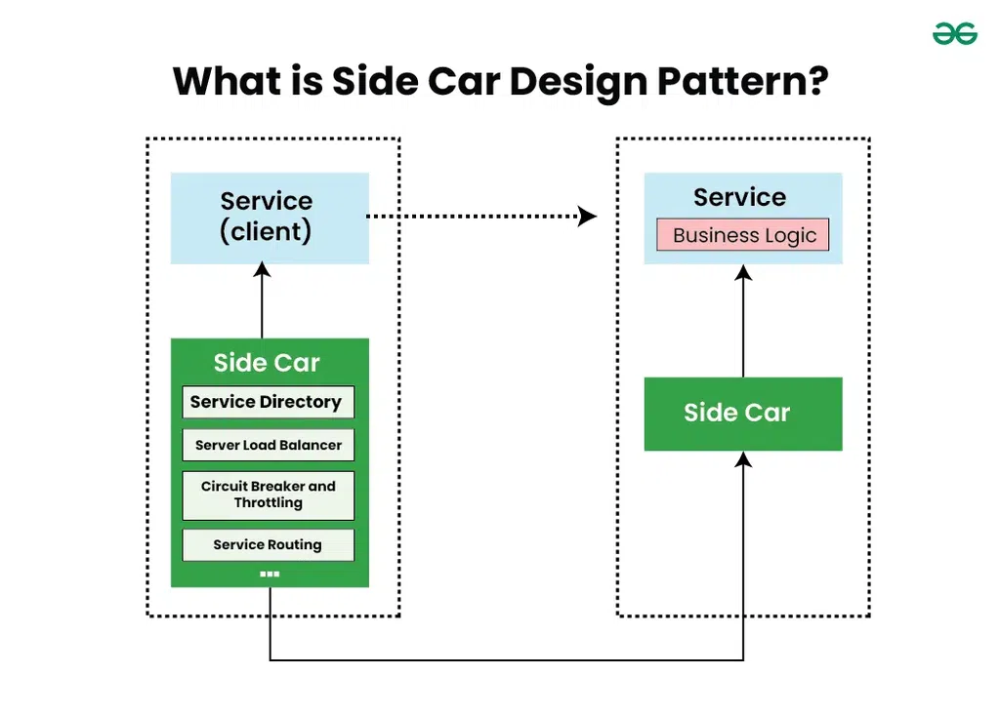

# Sidecar Design Pattern for microservice
- involving the deployment of secondary containers, or "sidecars," alongside microservice instances
- sidecar containers handle auxiliary tasks such as logging, monitoring, and security, enhancing the functionality and manageability of microservices.
## What is a sidecar design pattern
- In this pattern, a "sidecar" container or process is deployed alongside a primary application container to extend or enhance its functionality.
- The sidecar container runs within the same execution environment as the primary application and typically provides supporting services such as logging, monitoring, security, or communication with other services.
- enables the primary application container to focus on its core functionality while offloading secondary tasks(logging, monitoring, security, service discovery, or communication proxies) to the sidecar,
- promoting modularity, scalability, and maintainability in distributed systems.

## Why do we need Sidecar pattern in microservice?
- Several Benefits
    - **Modularity and Encapsulation**
    - **Scalability**
    - **Flexibility and Extensibility**: allows for flexible and extensible architectures by enabling the addition of new functionalities or services without modifying the primary microservices. 
    - **Isolation of Concerns**: maintain clear boundaries between concerns.
    - **Dynamic Configuration and Orchestration**